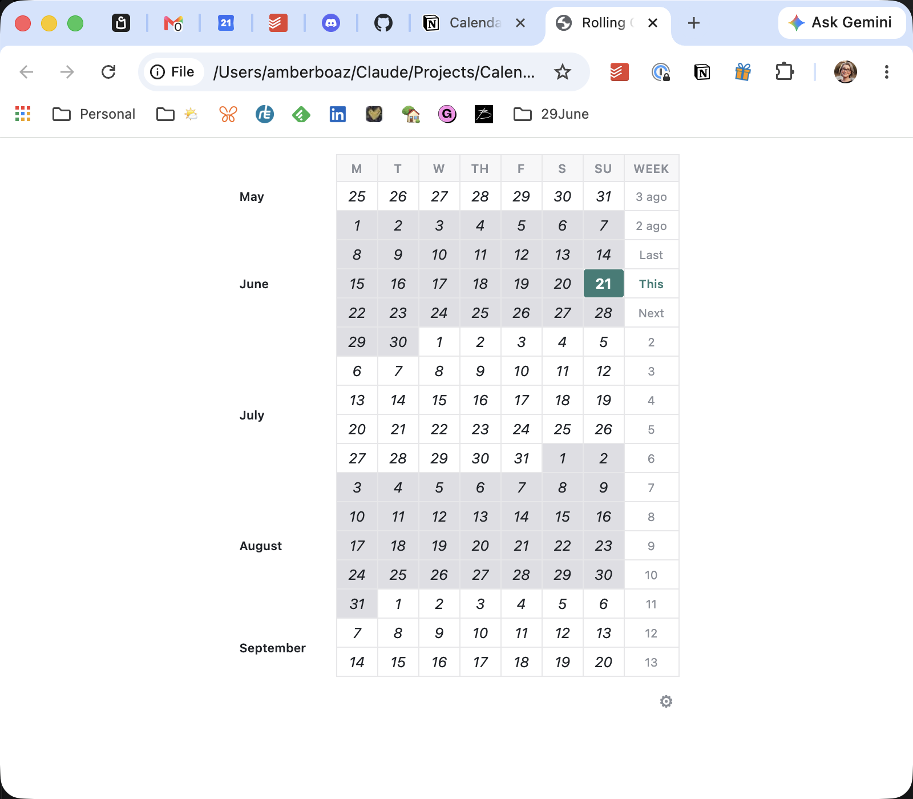
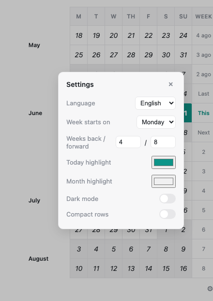

# Rolling Calendar Widget for Notion

A lightweight, embeddable calendar widget that shows a rolling window of weeks centered on today — designed to drop straight into any Notion page.



**[Live demo →](https://amber9904.github.io/calendar-in-notion-widget/)**

---

## Features

- **Rolling week view** — see past and upcoming weeks at a glance, centered on today
- **Today highlight** — current day is always visually distinct
- **Month banding** — alternating background colors make month boundaries easy to scan
- **Relative week labels** — This, Next, Last, and numbered weeks in the right column
- **Fully customizable** — colors, week start day, number of weeks, compact mode, dark mode
- **Multi-language** — English, Español, Français, Deutsch
- **Persistent settings** — all preferences saved in `localStorage`

---

## Embed in Notion

1. In Notion, type `/embed` and choose **Embed**
2. Paste the URL: `https://amber9904.github.io/calendar-in-notion-widget/`
3. Click **Embed link**

> **Tip:** If Notion shows a stale version after an update, add `?v=2` (or increment the number) to the embed URL to force a refresh.

---

## Settings

Click the **⚙** icon at the bottom-right of the widget to open the settings modal.



| Setting | Description |
|---|---|
| **Language** | Display language for month names, day abbreviations, and week labels. Options: English, Español, Français, Deutsch. |
| **Week starts on** | Choose whether weeks begin on Monday or Sunday. Affects the day column order and which week is highlighted as "current." |
| **Weeks back / forward** | Controls how many weeks appear above and below today. Default is 4 back and 8 forward. Accepts 0–26. |
| **Today highlight** | The accent color used for today's cell. Click to open a color picker. |
| **Month highlight** | The background color applied to alternating months, making month boundaries easy to scan. The widget stores separate values for light and dark mode — switch modes to adjust each independently. |
| **Dark mode** | Toggles a dark background theme. Switching modes also updates the Month highlight picker to show the dark-mode value. |
| **Compact rows** | Reduces row height and font size for smaller embeds where vertical space is limited. |

Close the modal by clicking **×**, pressing **Escape**, or clicking anywhere outside it.

---

## Self-hosting

The widget is a single `index.html` file with no dependencies.

```bash
git clone https://github.com/amber9904/calendar-in-notion-widget.git
```

Open `index.html` in any browser, or deploy to any static host (GitHub Pages, Cloudflare Pages, Netlify, etc.).
